# 3D Visualization of Geospatial Data with Blender
This tutorial intends to provide basic tips for importing and processing Geospatial data in [Blender](https://www.blender.org/) using [BlenderGIS Addon](https://github.com/domlysz/BlenderGIS).

### Part 1.  
[I. Basics of Blender interface](#basics-of-blender-interface)<br>
[II. Georefrencing the Blender Scene](#georefrencing-the-blender-scene)<br>
[III. Importing Geospatial data](#importing-geospatial-data)<br>
[IV. Materials and Texture](#materials-and-texture)<br>
[V.Rendering](#rendering)<br>
### Part 2. Step-by-step examples 
[Example A: Light up the terrain with viewsheds](#example-a:-light-up-the-terrain-with-viewsheds)<br>

## What is blender and why Blender?
Blender is an open-source 3D modelling, rendering and game engine software. You can create photorealistic scenes and lifelike animations with it. The feature that makes Blender highly suitable for geospatial visualization is its capability import various georeferenced data thanks to [BlenderGIS addon](https://github.com/domlysz/BlenderGIS)). Almost every operation done in the blender interface, can be scripted in the Python scripting environment, allowing you to automate or batch process your 3D modelling workflow. Moreover, powered by the [sketchfab addon](https://sketchfab.com/exporters/blender), you can easily export and publish your online geospatial models inside blender, so that everyone can interactively explore or download your work. <br> 
[Learn more about Sketchfab]()<br>
[A sample geospatial model in Sketchfab](https://sketchfab.com/models/298dfaf54e4447459275493e7b2adf96)<br>


## Basics of Blender interface

Blender has numerous components and features that, thanks to it open-source capabilities, are growing every day. Covering all aspects of the software itself require several lessons. The purpose of this section is to provide a brief introduction to Blender's graphical user interface and some of its features that are essential for working with geosptail data, and will be used throughout this tutorial. 

|Blender interface|
|:---:|

### Editors
Blender has a number of editors to view and modify various aspect of data. You can set each of the viewports to a specific editor and you can do that by clicking on the *editor type selector* on left side of a header. This allows you to reorganize and customize the interface based on your project needs and preferences. Also, you can add editors by dragging the triangular shaped stripes at corners of each viewport. Below we will review some of them that are most relevant to handling geospatial data.

### 3D view
The 3D View is the visual interface with the 3D data and scene with numerous functionalities for modeling, animation, texture painting, etc. Unlike 2D environment of Arcmap, where you can only navigate in x and y directions, 3D viewport allows full control over our viewing angle, the depth, the size and etc. You can press and hold down mouse scroll (or middle click) button to change the viewing angle (or orbiting around), shift and drag to pan, and roll to zoom back and forth. 

Now note the toolbar on the left side of the region which is called *Tool shelf* and it has a variety of the tools for 3D editing. Newly installed addons also appear in this toolbar. Now notice the bottom toolbar- so called *Header*. Header includes menues for adding, editing objects as well as viewing and shading options.


| 3D view header (retrieved from Blender manual)|
|:---:|

Header's __View menu__ allow you to select a specific viewpoint such as top, left or different perspectives. Also notice that each of these commands have a keyboard shortcut associated with them. For example you can push `numpad 3` (if you have a full keyboard) to switch to top view.

Now let's try using the __add menu__ to add some simple, so called primitive objects to the blender scene. Before doing that I would like to grab your attention to the target shaped icon, so called called 3D cursor, in the 3D viewport. Any item added to the scene will be placed at any location that the 3D cursor is. You can move the 3D cursor by left clicking on any location in the 3D scene. If you want to know or define the exact location of your 3D cursor, you should press N key on the 3D to unhide the right toolbar, inside which you can find the 3D cursor coordinates. Note that as I am changing the cursor location, the coordinates change. Now I lets say we want to add a sphere in a location with the 2,2,0 coordinates. From the add menu, select mesh and then choose UV sphere. Note that you can change the object parameters right after creation from the left toolbar, like level of detail, location and size.

The other useful option is the interaction mode using which you can toggle between the normal object mode and edit mode. Edit mode allows to access more low-level structure of your object, like faces, and vertices. In the next session, we will use some of these options to refine the surface model. For now it is important to get familiar with the 3 core elements, *faces*, *edges* and *vertex*. You can select these elements by clicking on their corresponding icons.
 
One the right side of the interaction mode, is the viewport __Shading mode__ using which you can choose the visualization and viewport rendering method. Default is the *Solid mode* that shows objects with solid faces, but without textures and shading. The *Material mode* shows the object with textures and is suitable for having an idea how 3D objects may look like with materials. The *Rendering mode*, enables real-time rendering, which computes the near-to-final product on-the-fly as you interact with the object.
 
[Learn more about 3D view](https://docs.blender.org/manual/en/dev/editors/3dview/introduction.html#tool-shelf)

### Properties editor 

__Properties editor__ allows you to modify the properties of the scene, rendering setting, transforming objects or changing their material or texture properties. The components that we will work with in the following examples are *object, material and texture properties*. 

In the __Object properties__ tab you can transform the location, orientation and scale of the object, along with display properties of them. You can use numeric input for transformation parameters.

In __Materials__ tab you can assign or change an object’s material. You can add and remove material, or use material browser to assign previously created materials to the object. Some very basic material parameters include *Diffuse and Specular*. You can adjust the diffuse parameters to change the color and shading of the material and with Specular adjust the glossiness of the material. Also, play with the shading and transparency parameters to see you it impacts your object. 
 
In __Texture tab__ you can assign texture to the materials. You can select from available textures already available in scene using texture browser, or load a new one from hard drive. Textures are not only applied as the surface color and pattern, they can also be used to adjust the surface transparency and roughness. For example, you can assign a black and white image texture to represent the surface roughness of a wood. 

Note: Properties editor's interface is dynamically changing according to the selected object. For example, if you select the light, the little sun icon will appear to set the light properties or similarly you should select camera to be able to see the camera tab and modify the properties. 

|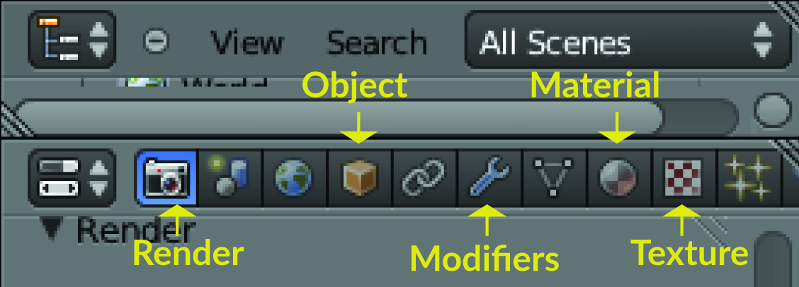 Properties panel|
|:---:|

### Outliner
As its name suggests, outliner lists and organizes the scene objects. From there you can set the hierarchy, visibility of the object's or lock them if you need. You can also select and activate objects by clicking on their name in the list. 

### Python console
### Python Editor
### Node Editor

[learn more about editors](https://docs.blender.org/manual/en/dev/editors/)

#### Basic object selection and interaction 

Objects are basically everything that you see in the 3D view. They include 3D objects, lights and camera. You can select any object in the scene using the mosue right-click. Selected objects are highlighted in orange so you can easily distinguish them. Use the 3 axis, so called handles to move the object in your prefered direction. To select multiple objects, press and hold `control` key and right click on objects to add to your selection. You can rotate objects by pressing `R` keyboard button, or scale objects using `S` key. Note that when you are transforming an object, a numeric output on the left bottom of the 3D viewport will give you more precise feedback on how much you moved, rotated or scaled an object. You can delete the object by selecting it, pressing `delete` key and selecting ok. 

Other Complementary resources for learning blender interface
[Blender manual](https://docs.blender.org/manual/en/dev/interface/index.html)
[CG cookie](https://www.google.com/search?q=introduction+to+blender+interface&oq=introduction+to+blender+interface&aqs=chrome..69i57.5976j0j1&sourceid=chrome&ie=UTF)

----------

## Georeferencing the Blender Scene

In this section we will learn how to setup blender GIS addon, georeferences and importing raster files and assigning textures to them. We will use Dorothia Dix park as a case study for this tutorial. 

#### Downloading the tutorial folder and material 
* Go to workshop [link](https://github.com/ptabriz/ICC_2017_Workshop) and click on download, then download as zip option
* Extract the zip file

#### Setting up Blender GIS addon
* [Download](https://github.com/ptabriz/BlenderGIS) the customized version of BlenderGIS addon and  make sure that addon and required dependencies are properly installed
* Open Blender 
* Go to __file__ >  __user preferences__ ( `Alt + Ctrl + U` ) > __Add-ons__  
* In the search tab, on top left type "gis" and make sure that in the __Categories__ section __All__ is selected.
* In the search results you should be able to see __3Dview: BlenderGIS__. Select to load the addon.
* From the bottom of the preferences window click __Save User Settings__ so the addon is loaded next time you open blender
 
#### Adding a new predefined coordinate reference system (CRS)

Before setting up the coordinate reference system of the Blender scene and configuring the scene projection, you should know the Coordinate Reference System (CRS) and the Spatial Reference Identifier (SRID) of your project. In GRASS GIS, CRS information can be retrieved using  `v.info` or `r.info` functions . You can get the SRID from [http://epsg.io/](http://epsg.io/) or [spatial reference website ](http://spatialreference.org/) using your CRS. The example datasets in this exercise uses a NAD83(HARN)/North Carolina CRS (SSRID EPSG: 3358)   

* In BlenderGIS add-on section (in preferences windows), select to expand the __3D View: BlenderGIS__  
* In the preferences section find __Spatial Reference system__ and click on the __+ Add__ button 
* In the add window put  "EPSG: 3358" for __definition__ and "NAD83(HARN)/North Carolina" for __Description__. Then select __Save to addon preferences__

[Learn more](https://github.com/domlysz/BlenderGIS/wiki/Gereferencing-management) about Georefencing management 

#### Opening the blender file and setting the Coordinate system
* Go to __file__ > __open__  and browse to find the downloaded 'ICC_workshop' folder and open the 'ICC_viewshed_example.blend' file
* From the __3D view__ toolbar (on the left side of the screen) , find __GIS__ panel 
If you cannot find the GIS tab, then check if the add-on is properly installed and activated in blender preferences (step 2.2 )
*  In the second section of the panel , __Geoscene__, click on the Gear shaped icon. You should be able to find and select the __NAD83(HARN)/North Carolina__ preset. Click on __Ok__ to set it as scene coordinate system.

----------

## Importing Geospatial data

#### Georasters
Rasters can be imported and used in different ways. You can import them _As DEM_ to use it as a 3D surface or as_Raw DEM_  to be triangulated or skinned inside Blender. You can select _On Mesh_ to drape them as a texture on your 3D meshes. In this example, we import a digital surface model (DSM) derived from Lidar data points dataset as a 3D mesh using _As DEM_ method. 
Note: Blender GIS imports both Digitial elevation model (DEM) and Digital surface model (DSM) through _As DEM_ method.

* Go to  __file __ > __menu__ > __import__ > __Georeferenced raster__ > .Alternatively you can access raster import using raster icon in Blender GIS toolbar
* On the bottom left side of the window find  __Mode__ and select __As DEM__
* For __Subdivision__ select  __Mesh__ and make sure that __CRS__ is set to NAD83(HARN)/North carolina.
* Browse to the 'ICC_workshop' folder and select 'dsm.tif'
* If all the steps are followed correctly, you should be able to see the terrain in 3D view window 

Note: When importing your own raster data, you might encounter situations where the DSM is imported as a flat surface. Make sure that 1) you selected the _As DEM_ method 2) the raster resolution is not very low, 3) the data-type is float32, and 4) the coordinate system of the raster is matching the Blender Scenes' coordinate system. For more detailed instructions and troubleshooting read [georeference raster import](https://github.com/domlysz/BlenderGIS/wiki/Import-georef-raster) wiki .

__`Python console >>>`__
```python
bpy.ops.importgis.georaster(filepath="C:\ICC_workshop\dsm.tif", 
                            importMode="DEM", subdivision="mesh", 
                            rastCRS="EPSG:3358")
```

#### Surface subdivision and refinement
Usually when surface or elevation models are imported in Blender they are downsampled to a defaults subdivision resulting in smoothing out the surface details.
The following procedure subdivides the imported mesh into smaller faces to enhance the surface representation. 

* Select surface model (right click on the object)
* Go to __3D view__ editor's bottom toolbar > __Object interaction mode__ >  __Edit Mode__ 
* Switch to __Face select__
* Go to __View__ > __(De)select All__ (or press `A`) to select all faces 
* Go to __Tools___(left toolbar) > __Mesh__ > __Subdivide__ . The subdivide dialogue should appear on the bottom left on the toolbar. Type "5" in the number of cuts tab
* Go to __3D view__ editor's bottom toolbar > __Object interaction mode__ >  __Object Mode__ . You should be able to see the surface details at this point. 


__`Python editor`__
``` python
import bpy
bpy.ops.object.mode_set(mode='EDIT')
bpy.ops.mesh.select_all(action='SELECT')
bpy.ops.mesh.subdivide(number_cuts=5, smoothness=0.2)
bpy.ops.object.mode_set(mode='OBJECT')
```
Note: The subdivision number is based on your data resolution. Increasing the subdivision parameter may results in a very large blender file which heavily slows down the modelling. Try diffrent subdivision parameters to find the lowest number that produces the ideal precision

----------

## Materials and Texture
In this section we will drape the cumulative viewshed as a texture on the DSM. You can apply textures to the 3D surfaces in blender using complex mapping methods (e.g. height mapping, bump mapping, normal mapping, displacement mapping, reflection mapping, specular mapping, mipmaps, occlusion mapping). However, [texture mapping](https://en.wikipedia.org/wiki/Texture_mapping) is beyond the scope of this tutorial. If you are interested to learn more about texture mapping and materials in blender, [Blender wikibooks](https://en.wikibooks.org/wiki/Blender_3D:_Noob_to_Pro/Materials_and_Textures) is a good place to start. 

* Select __Cycles Render__ as your rendering engine (top header). Cycles is Blender’s ray-trace based production render engine. 
* Change the bottom editor panel to __node editor__. This can be done by simply changing the _Editor Type selector_ button which is located at the left side of a header. _Node editor_  allows you to visually design workflows related to materials and textures in environment. Discover more about node editor. [here](https://www.blender.org/manual/en/editors/node_editor/introduction.html)
*  Go to __3D view__ bottom header (bottom of the window), find __Viewport shading__ button and select __Material__
*  Go to __Properties tab__ > __Material__ > Press __+ New__ button to add material
*  Rename the material name to "cumulative_viewshed"
*  Expand the __Surface__ section and click on the gray square shaped icon on right side on the __color__ parameter to see a popup window with texture parameters. Select __Image texture__
*  Click on the open icon to browse the images. Load "ICC_workshop\cumulative_viewshed.png". Now you should be able to see the texture draped on the terrain (make sure you are in Material view mode)
*  Go to __Properties panel__ > __Material__  and from __Material browser select__ 'Ortho_texture'. Now you should be able to see the material workflow in node editor
*  On the left node , _image Texture_ , find __open image__ , and browse to the geospatial folder to 'select the Ortho.png'. You should be able to see the texture draped on the terrain 
*  Go to __3D view__ bottom header (bottom of the window), find __Viewport shading__ button and select __rendering__ to see the on-the-fly rendering of the model with shadows. 

Discover more about render engines and cycles [here](https://www.blender.org/manual/render/cycles/introduction.html)

__`Python editor`__
``` python
import bpy
# Create a new material and assign it to the DSM object # 
mat = (bpy.data.materials.get("cumulative_viewshed") or 
       bpy.data.materials.new("cumulative_viewshed"))
bpy.data.objects["dsm"].data.materials.append(mat)

# Get material tree , nodes and links # 
mat.use_nodes = True
node_tree = bpy.data.materials["cumulative_viewshed"].node_tree
nodes = node_tree.nodes
links = node_tree.links

# Add a new texture node and link it to the diffuse color node# 
textureNode = node_tree.nodes.new("ShaderNodeTexImage")
textureNode.select = True
node_tree.nodes.active = textureNode
img = bpy.data.images.load('D:\GitHub\ICC_2017_Workshop\cumulative_viewshed.png')
textureNode.image = img
matnodes = bpy.context.active_object.material_slots[0].material.node_tree.nodes
imgnodes = [n for n in matnodes if n.type == 'TEX_IMAGE']
for n in imgnodes:
    if n.image.name == 'cumulative_viewshed.png':
        n.select = True
        matnodes.active = n
diffuseNode = nodes [1]
links.new (textureNode.outputs["Color"], diffuseNode.inputs[0])
```

## Rendering

There two different ways to render scene in _Cycles render engine_. You can activate _Real time-rendering_ that is useful for quick previews or GPU rendering for final output. Note that the GPU rendering is by default setup to render only active camera. 

* In 3D_view bottom header find  __Shader option__ and select __Rendered__ . Interact with the 3D model to see how it is rendered on the-fly.
* Set one of the windows (scripting or node editor) to camera view. This can be done by selecting 3D view from bottom header of the window.  Then select the desired camera by right-clicking on the camera object in 3D view or selecting the object name (e.g, camera) in _outliner_. Then, set the 3D view to camera using __NUM0__.
* For final rendering push __F12__ after selecting the desired camera. For changing the render output and parameters, use the __Render__ tab in the __Properties__ panel. 

__`Python Console >>>`__
``` python
# Change the 3D view shader to rendered
bpy.context.space_data.viewport_shade = 'RENDERED'
#Change the active camera to object 'Camera' and set 3D view window to camera
cameraObj = bpy.data.objects['Camera']
bpy.context.scene.objects.active = cameraObj
bpy.ops.view3d.object_as_camera()

#Render directly to the file path 
bpy.context.scene.render.filepath = "D:\\ICC_conference\\Render\\"
bpy.ops.render.render() 
```
```html
# Render in background using windows run command
../blender-2.77a-windows32/blender.exe d:/test/test.blend --render-output d:/test/ --engine CYCLES --render-format PNG --use-extension 1 --render-frame 1
```

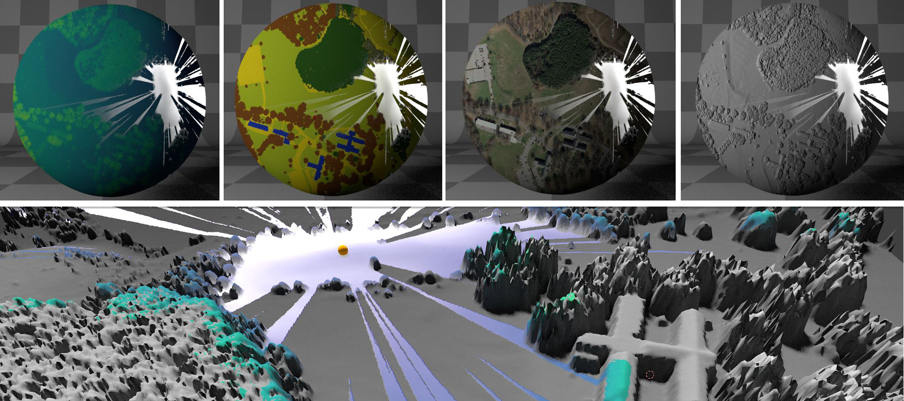


## Example A: Light up the terrain with viewsheds 
This is a step by step example for importing a dsm and comparing four viewsheds on diffrent instances of the model.   
You can use the menu interface or python scripting to complete the example. 

### Setting up the scene 
* Run blender application
* Select the default __Cube__ object in 3D viewport and delete it (right-click on the object > press delete > ok )
* Set __render engine__ to "Cycles". You can find it in the top header, the default is "Blender Render"
* Increase the _Lamp__ elevation and change the Lamp type to "Sun" for appropriate lighting
    * Left click on the __Lamp__ object in __Ouliner__ (on the right side wih objects' list) to select it
    * Go to __Properties editor__ > __Object__ (the orange cube icon) > __Transform__ section > change the *Z* value to 1000
* Chane lamp type to Sun and increase the emmision
    * Go to __Properties tab__ > __Lamp__ > expand the __Lamp__ section > Change lamp type to *Sun*
    * Expand the __Nodes__ section > Select __Use Nodes__ to enable modifying Sun parameters.
    * Set the __Strenght__ parameter to 6.00

__`Python editor`__
```python
import bpy
# remove the cube 
cube = bpy.data.objects["Cube"]
cube.select = True
bpy.ops.object.delete()

# change lamp type and elevation
import bpy
lamp = bpy.data.lamps["Lamp"]
lamp.type = "SUN"
lampObj = bpy.data.objects["Lamp"]
lampObj.location[2] = 1000

# Setup node editor for lamp and increase the lamp power
lamp.use_nodes = True
lamp.node_tree.nodes["Emission"].inputs[1].default_value = 6

# Set render engine to cycles
bpy.context.scene.render.engine = 'CYCLES'
```

|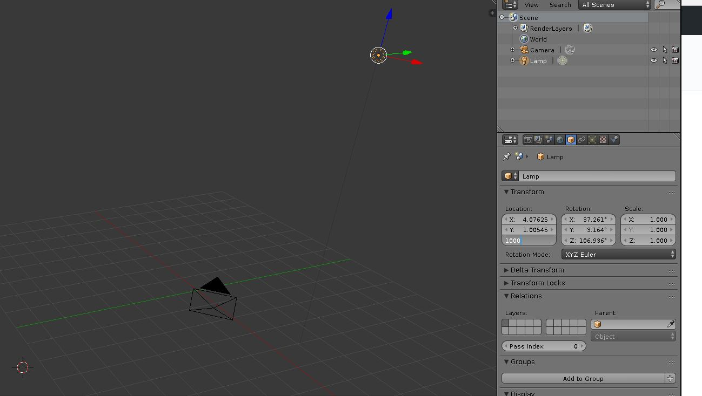 Changing the lamp elevation|
|:---:|

### Setting up coordinate system 

 Note: Before proceeding with this step make sure that BlenderGIS addon is already setup and NAD83(HARN) has been defined in the setup preferences. 
* Find and click on GIS addon’s interface in 3D viewport’s left toolbar. In the “Geoscene” section , click on the gear shape icon and switch to NAD83(HARN), click ok.

|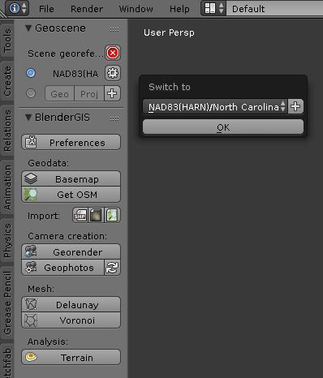 <br> Georeferencing setup in Blender GIS |
|:---:|

### Importing DSM
* Go to __file__ > __import__ > __Georeferenced Raster__ 
* Set __subdivision__ to *Mesh* and select *NAD83(HARN)* for georeferencing
* Browse to the 'ICC_workshop' folder and select 'example1_dsm.tif'
* Click on __Import georaster__ on the top right header
* If all the steps are followed correctly, you should be able to see the terrain in 3D view window

__`Python editor`__
``` python
import bpy
import os
filePath = os.path.dirname(bpy.path.abspath("//"))
fileName = os.path.join(filePath,'example1_dsm.tif')
bpy.ops.importgis.georaster(filepath=fileName, 
                            importMode="DEM", subdivision="mesh", 
                            rastCRS="EPSG:3358")
```
|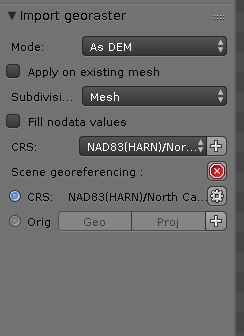 <br> Georaster import parameters|
|:---:|

### Surface subdivision and refinement

* Select surface model (right click on the object)
* Go to __3D view__ editor's bottom toolbar > __Object interaction mode__ >  __Edit Mode__ 
* Switch to __Face select__
* Go to __View__ > __(De)select All__ (or press `A`) to select all faces 
* Go to __Tools___(left toolbar) > __Mesh__ > __Subdivide__ . The subdivide dialogue should appear on the bottom left on the toolbar. Type "4" in the number of cuts tab
* Go to __3D view__ editor's bottom toolbar > __Object interaction mode__ >  __Object Mode__ . You should be able to see the surface details at this point (figure 1, right).

__`Python editor `__
``` python
import bpy
bpy.ops.object.mode_set(mode='EDIT')
bpy.ops.mesh.select_all(action='SELECT')
bpy.ops.mesh.subdivide(number_cuts=4, smoothness=0.2)
bpy.ops.object.mode_set(mode='OBJECT')
```

| DSM surface after importing| DSM surface after subdivision|
|:---:|:---:|

### Importing viewpoint shapefiles
In this step we will import viewpoint locations as a point feature shapefile and will replace them with spheres to visualise observer location
* Import viewpoint shape file 
   * Go to __file__ > __import__ > __Shapefile__ 
   * Browse workshop data directory, select *vpoint.shp* and click on __Import Shp__ . The shape import dialogue should appear in front of the GIS adoon interface. 
   * Activate “Elevation from field” and in field section select “height”
   * Activate “Elevation from field” and in field section select “height”
   * Activate “Separate objects” 
   * Activate “Object from field” and in field section select “Name”, you should be able to see 4 the points on the surface and 4 objects added to the Outliner with the names *Viewshed_1, Viewshed_2,Viewshed_3, Viewshed_4*


|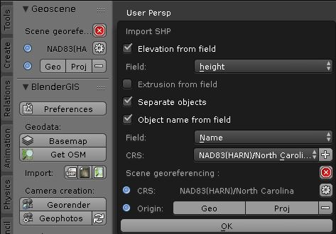 <br> Blender Gis shape import dialogue|
|:---:|
__`Python editor`__
```python
import bpy
import os
filePath = os.path.dirname(bpy.path.abspath("//"))
fileName = os.path.join(filePath,'vpoints.shp')
bpy.ops.importgis.shapefile(filepath=fileName,fieldElevName="height",fieldObjName='Name',separateObjects=True,shpCRS='epsg:3358')
```

* Create spheres on the viewpoint location
    * Go to 3D Viewport’s __bottom header__ > __Add__ > __Mesh__ > __UV sphere__. The Add UV phere dialogue will open on the left side of the Toolbar. Set the Size parameter to 3.000
    * Select Sphere object and press Shift + D or ctrl+c , ctrl+v to make a copy of the object, you should see the *Sphere.001* in the outliner 
    Make 3 copies of the sphere and rename them to *Sphere1, Sphere2, ... , Sphere4*
    * From __Outliner__ select the object *Viewshed_1* 
    * Go to __Properties Editor__ > __Object__ > __Location__ to retrieve the viewshed point’s coordinates (X,Y,Z)
    * Move each of the 4 spheres to the corresponding viewshed location by typing in the coordinates in their location parameter (Properties Editor > Object > Location). Add 2.0 extra unit to the Z parameters to raise the spheres above the ground You should now have 4 spheres aligned on the imported viewshed points. 

__`Python editor`__

```python
import bpy
# get get viewpoint objects create a sphere using their X,Y and Z+2 coordinates
for obj in bpy.data.objects:
    if "Viewshed" in obj.name:
        bpy.ops.mesh.primitive_uv_sphere_add(size=3.0, location=(obj.location[0],obj.location[1],obj.location[2]+2))
        sphere = bpy.context.active_object
        # rename the sphere
        sphere.name = "Sphere" + obj.name[-2:]
```

|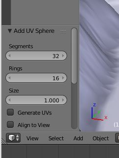 <br> UV Sphere toolbar|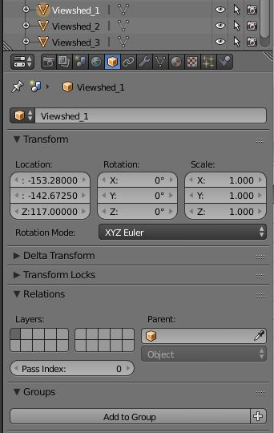 <br> Object transform panel in properties editor|
|:---:|:---:|

|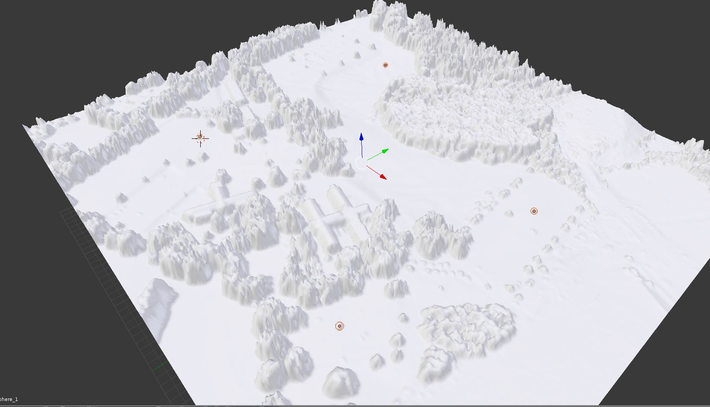 <br> 4 spheres representing observation points|
|:---:|

### Generating 4 copies of the surface and viewpoint spheres 

* Select DSM object and press `Shift + D` or `ctrl+c` , `ctrl+v` to make a copy of the object , you should see the example1_dsm.001 in the outliner 
* Select the "example1_dsm1"
* While Holding shift key select "Sphere_1" from outline to select both DSM and corresponding Sphere
* go to __Properties Editor__ > __Object__ (cube icon) 
* In the __Transform__ section > __Location__ > __X:__ type *750* to move the duplicated surface 750 meters to the east  
* Create another copy of the DSM , put -750 for Y parameter to move the duplicate surface 750 meters to the south
* Create another copy of the DSM, put 750 for X parameter and -750 in Y parameter. The final model should look like figure 


__`Python editor`__
``` python
import bpy

for ob in bpy.data.objects:
    ob.select = False
obj = bpy.data.objects["example1_dsm"]
obj.name = "example1_dsm1"
obj.select = True

# create and rename 3 replicates of DSM, and move spheres to create 4 DSMs and spheres
bpy.ops.object.duplicate_move(OBJECT_OT_duplicate={"mode":'TRANSLATION'}, TRANSFORM_OT_translate={"value":(750, 0, 0 )})
bpy.data.objects ["example1_dsm1.001"].name = "example1_dsm2"
sphere2Obj = bpy.data.objects ["Sphere_2"]
loc = sphere2Obj.location
sphere2Obj.location = (loc[0]+750, loc[1], loc[2])

bpy.ops.object.duplicate_move(OBJECT_OT_duplicate={"mode":'TRANSLATION'}, TRANSFORM_OT_translate={"value":(0, -750, 0 )})
bpy.data.objects ["example1_dsm2.001"].name = "example1_dsm3"
sphere3Obj = bpy.data.objects ["Sphere_3"]
loc = sphere3Obj.location
sphere3Obj.location = (loc[0]+750, loc[1]-750, loc[2])

bpy.ops.object.duplicate_move(OBJECT_OT_duplicate={"mode":'TRANSLATION'}, TRANSFORM_OT_translate={"value":(-750, 0, 0 )})
bpy.data.objects ["example1_dsm3.001"].name  = "example1_dsm4"
sphere4Obj = bpy.data.objects ["Sphere_4"]
loc = sphere4Obj.location
sphere4Obj.location = (loc[0],loc[1]-750, loc[2])
```

|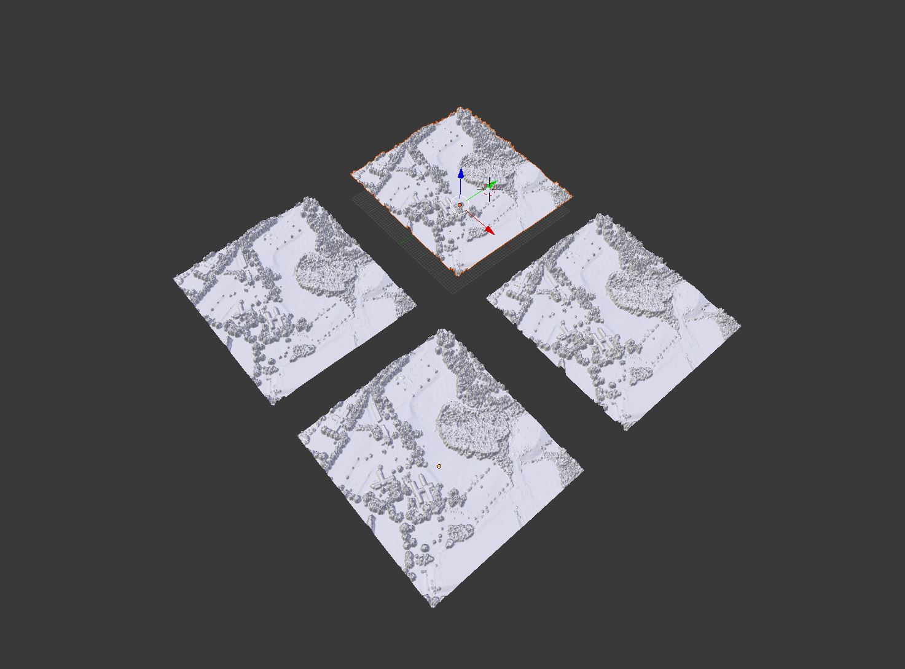 Replicated models|
|:---:|

### Shading Viewsheds and Viewpoints 
Now we will create a mixed material to combine Orthophoto and viewshed maps. We will use emission shaders to show viewsheds as glowing surfaces.

* Make sure that the __Render engine__ is set to *Cycles* and 3D viewport __Shading__ is set to *Material*
* Change the bottom editor panel to __Node editor__. This can be done by simply changing the Editor Type selector button which is located at the left side of a header.
* Add another environment and chane it to __Text editor__ 
* Select the first DSM object "example_dsm1"
* Go to __Properties tab__ > __Material__  Press __+ New__ button to add material
    * Rename the Material to "Viewshed1"
    * Expand the __Surface__ section and click on the gray square shaped icon on right side on the __color__ parameter to see a popup window with texture parameters. Select __Mix Shader__ . You should be able to see two __Shaders__ added below the mix shader. 
* Click on the first shader and select *Emission* from the dropdown list
    * Click on the radio button on the left side of the __color__ field  >  __texture__ >  __Image texture__
    * Click on __Open__ and load "viewshed_1_1.png". You should be able to see the viewshed draped on the DSM surface
    * Change the __Strenght__ slider to 1.8 to increase the viewshed's emission power
* Click on the second shader and select *Diffuse BSDF* from the dropdown list
    * Click on the radio button on the left side of the __color__ field  >  __texture__ >  __Image texture__
    * Click on __Open__ and load "orto.png". You should be able to see the viewshed draped on the DSM surface

Now notice how the material logic and workflow is represented in Node editor. You can play with each of the individual nodes ,the links between them and the values. 
* Play with the __Fac__ slider on the __Mix shader__ node to adjust the mixture level 
* Repeat the shading procedure for the other 3 objects using "Viewshed_1_2.png", "Viewshed_1_3.png", "Viewshed_1_4.png"  

|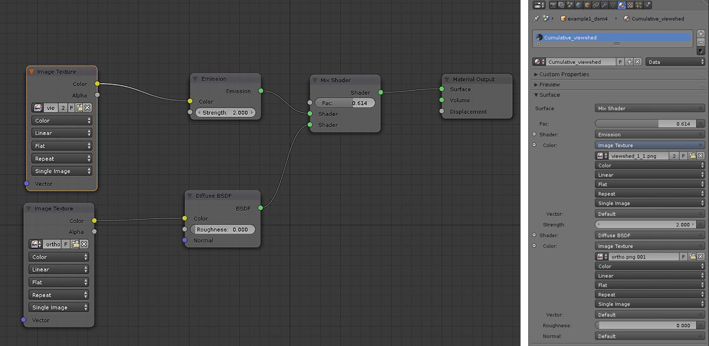 Node editor and Properties panel|
|:---:|

|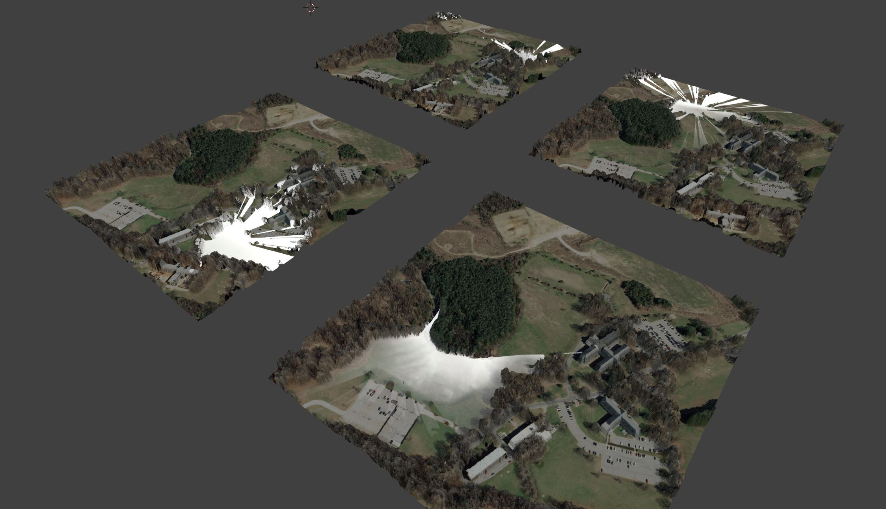 Viewshed and Orthophoto draped on DSM surface using Mix shader |
|:---:|

__`Python editor`__
``` Python
import bpy
import os
filePath = os.path.dirname(bpy.path.abspath("//"))
ortho = os.path.join(filePath, 'ortho.png')

for obj in bpy.data.objects:
    if "dsm" in obj.name :
        obj.select = True
        fileName = "viewshed_{0}_1.png".format(obj.name[-1:])
        matName = os.path.join(filePath, fileName)
# Create a new material and assign it to the DSM object # 3

        mat = (bpy.data.materials.get(matName) or 
               bpy.data.materials.new(matName))
               
        obj.data.materials.append(mat)

        # Get material tree , nodes and links # 
        mat.use_nodes = True
        node_tree = mat.node_tree
        nodes = node_tree.nodes
        links = node_tree.links
        for node in nodes:
            nodes.remove(node)
        diffuseNode = node_tree.nodes.new("ShaderNodeBsdfDiffuse")
        diffuseNode.location = (300,400)
        #diffuseNode = nodes["Diffuse BSDF"]

        # Add a new texture for viewshed # 
        viewshedNode = node_tree.nodes.new("ShaderNodeTexImage")
        viewshedNode.select = True
        node_tree.nodes.active = viewshedNode
        viewshedNode.image = bpy.data.images.load(matName)
        viewshedNode.location = (100, 100)

        # Add a new texture for ortho # 
        orthoNode = node_tree.nodes.new("ShaderNodeTexImage")
        orthoNode.select = True
        node_tree.nodes.active = orthoNode
        orthoNode.image = bpy.data.images.load(ortho)
        orthoNode.location = (100, 400)
        # Add a new mixshader node and link it to the diffuse color node# 

        mixShaderNode = node_tree.nodes.new("ShaderNodeMixShader")
        mixShaderNode.location = (600, 250)
        mixShaderNode.inputs["Fac"].default_value = .7
        emissionNode = node_tree.nodes.new("ShaderNodeEmission")
        emissionNode.location = (300, 100)
        outputNode = node_tree.nodes.new("ShaderNodeOutputMaterial")
        outputNode.location = (800, 250)
        emissionNode.inputs[1].default_value = 2

        links.new (viewshedNode.outputs["Color"], emissionNode.inputs["Color"])
        links.new (orthoNode.outputs["Color"], diffuseNode.inputs["Color"])
        links.new (emissionNode.outputs["Emission"], mixShaderNode.inputs[2])
        links.new (diffuseNode.outputs["BSDF"], mixShaderNode.inputs[1])
        links.new (mixShaderNode.outputs["Shader"], outputNode.inputs["Surface"])

```

Now follow the same workflow to shade viewpoint spheres but this time only use diffuse node (*Diffuse BSDF*) a with solid orange color. 

* Select the first sphere, create a new material using nodes
* Change the surface color to 
* repeate the same for all spheres 
``` python
import bpy
for obj in bpy.data.objects:
    if "Sphere" in obj.name:
        obj.select = True
        matName = "sphere"
    # Create a new material and assign it to the DSM object # 3
        mat = (bpy.data.materials.get(matName) or 
               bpy.data.materials.new(matName))
        obj.data.materials.append(mat)
        # Get material tree , nodes and links # 
        mat.use_nodes = True
        node_tree = mat.node_tree
        nodes = node_tree.nodes
        links = node_tree.links
        nodes[1].inputs[0].default_value = (.8, .3, 0, 1)
        obj.select = False
```
|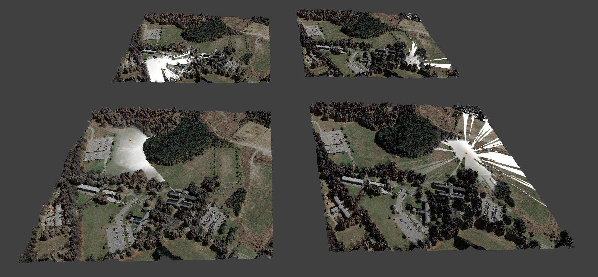 <br> Viewport render of the viewshed |
|:---:|

------------

### Acknowledgment
This work is built upon great contributions and support of [Blender](https://www.blender.org/) team, Blender GIS addon developers [(domlysz/BlenderGIS)](https://github.com/domlysz/BlenderGIS) , Center for [Geospatial Analytics](https://cnr.ncsu.edu/geospatial/) and [Vaclav Petras](https://github.com/wenzeslaus).
